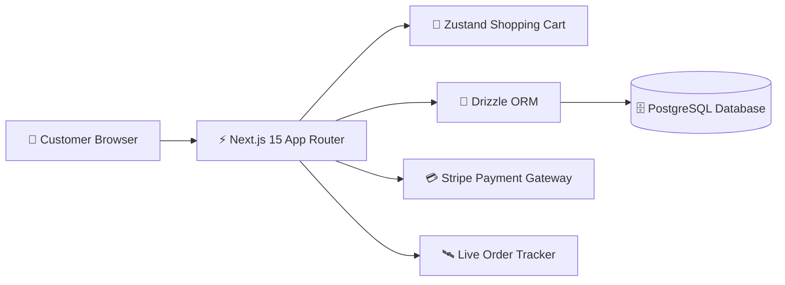

# 🌿 Amber & Herb — Farm-to-Table Food Court & Express Delivery 🥗✨

<div align="center">

[](https://nextjs.org/)
[](https://www.typescriptlang.org/)
[](https://tailwindcss.com/)
[](https://orm.drizzle.team/)
[](https://www.postgresql.org/)
[](./LICENSE)

**An organic food court and doorstep delivery platform built with Next.js 15 App Router, TypeScript, Tailwind CSS, and Drizzle ORM — delivering 100% farm-fresh, zero-preservative meals straight to customers.**

</div>

---

## 🌟 Key Features & Highlights

- 🥗 **Curated Organic Food Court**: Multi-vendor food catalog with live dietary filters (Vegan, Gluten-Free, Keto, High-Protein).
- 🛒 **Interactive Cart & Bundle Builder**: Instant state updates with Zustand, dynamic calorie calculation, and custom topping add-ons.
- 💳 **Secure Checkout Flow**: Integrated payment handling with address validation and real-time tax/delivery fee calculations.
- 🛰️ **Live Order Tracking**: Interactive order timeline showing preparation, dispatch, and estimated doorstep arrival.
- ⚡ **Ultra-Fast Next.js 15 Performance**: Server-side rendering (SSR), optimized responsive images, and instant page transitions.

---

## 🏛️ System Architecture



---

## 🛠️ Technology Stack

- **Framework**: Next.js 15 (App Router, Server Actions)
- **Language**: TypeScript (Strict Mode)
- **Database & ORM**: PostgreSQL with Drizzle ORM & Drizzle Kit Migrations
- **State Management**: Zustand
- **Styling & UI**: Tailwind CSS, Lucide Icons, Framer Motion
- **Form Validation**: Zod + React Hook Form

---

## 📂 Project Structure

```text
amber-and-herb/
├── src/
│   ├── app/                   # Next.js 15 App Router pages & API routes
│   │   ├── menu/              # Interactive food court catalog
│   │   ├── cart/              # Cart & checkout workflow
│   │   └── order-tracking/    # Live order timeline
│   ├── components/            # Navbar, FoodCard, CartDrawer, DietFilters
│   ├── db/                    # Drizzle ORM schema & database connection
│   │   └── schema.ts          # Products, Categories, Orders, Users tables
│   ├── lib/                   # Utility helpers, currency formatters
│   └── types/                 # Shared TypeScript data models
├── drizzle/                   # SQL migration scripts
├── public/                    # Product imagery & assets
├── package.json               # Dependencies and scripts
└── README.md                  # Project documentation
```

---

## 🚀 Getting Started & Local Setup

### Prerequisites
- **Node.js**: `v18.18.0` or higher
- **PostgreSQL**: Local instance or cloud database URL (e.g. Supabase, Neon)

```bash
# 1. Clone the repository
git clone https://github.com/SriniwasAwasthi/Amber-and-Herb.git
cd Amber-and-Herb

# 2. Install dependencies
npm install

# 3. Configure Environment Variables
cp .env.example .env.local
# Add your DATABASE_URL in .env.local

# 4. Push database schema
npx drizzle-kit push

# 5. Start development server
npm run dev
```

Open your browser to the local development server address to explore the live application.

---

## 📜 License

Distributed under the **MIT License**. See `LICENSE` for more information.

---

## 💖 Thank You for Visiting & Exploring Amber & Herb!

> *"Thank you for taking the time to explore this project! Continuous learning, clean craftsmanship, and solving real-world challenges through elegant software are at the core of my developer journey."* 🚀

* 🌟 **Enjoyed this project?** If you found this repository interesting or helpful, please consider giving it a **Star**!
* 📬 **Let's Connect & Collaborate:** I am actively seeking engineering opportunities, impactful internships, and open-source collaborations.
  * 💻 **GitHub:** [@SriniwasAwasthi](https://github.com/SriniwasAwasthi)
  * 📧 **Email:** [sriawasthi164@gmail.com](mailto:sriawasthi164@gmail.com)
  * 🌐 **LinkedIn:** [sriniwas-awasthi](https://www.linkedin.com/in/sriniwas-awasthi/)

---
<div align="center">
  <sub>Designed & Crafted with Passion by <a href="https://github.com/SriniwasAwasthi"><strong>Sriniwas Awasthi</strong></a> • Continuous Learner & Software Engineer</sub>
</div>
