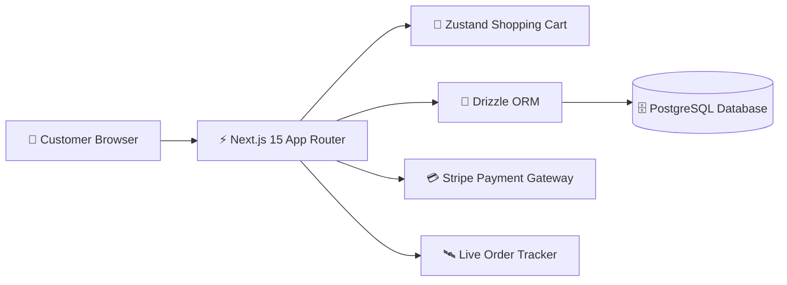

# 🌿 Amber & Herb — Eat Local, Eat Healthy 🥗✨

**An Online Food Court & Doorstep Delivery Platform delivering 100% organic, zero-preservative meals straight from local farms to your home in 48 hours! 🛵💨**

[🌐 View Live Screenshots](#-real-website-live-screenshots) • [🧩 Architecture & Components](#-application-architecture--component-structure-) • [🚀 Installation Guide](#-how-to-install--run-locally) • [

---

## 🏛️ System Architecture

---

## 💖 Thank You for Visiting & Exploring 🌿 Amber & Herb — Eat Local, Eat Healthy 🥗✨!

> *"Thank you for taking the time to explore this project! Continuous learning, clean craftsmanship, and solving real-world challenges through elegant software are at the core of my developer journey."* 🚀

* 🌟 **Enjoyed this project?** If you found this repository interesting or helpful, please consider giving it a **Star**!
* 📬 **Let's Connect & Collaborate:** I am actively seeking engineering opportunities, impactful internships, and open-source collaborations. Feel free to connect via [GitHub](https://github.com/SriniwasAwasthi) or [Email](mailto:sriawasthi164@gmail.com).

---

  Designed & Crafted with Passion by <a href="https://github.com/SriniwasAwasthi"><strong>Sriniwas Awasthi</strong></a> • Continuous Learner & Software Engineer

